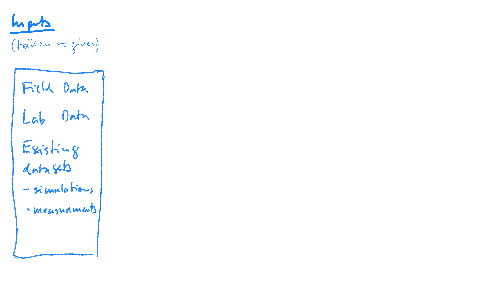
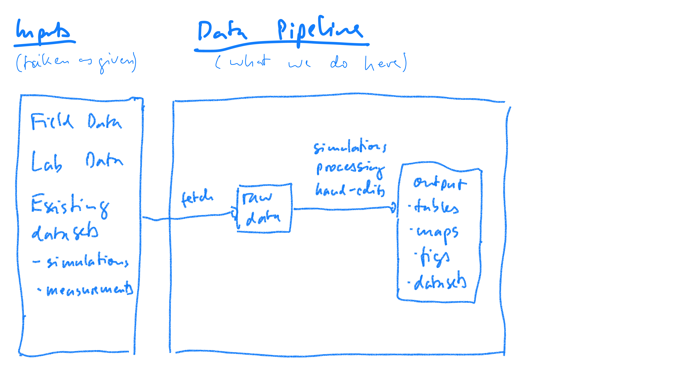
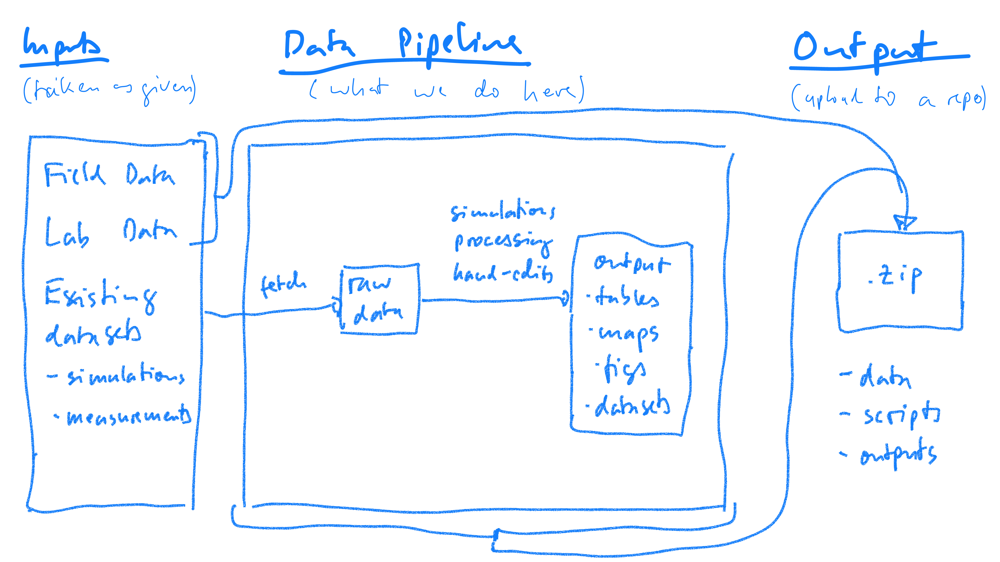

# Reproducible Research
### A Lot of Ins, A Lot of Outs

---

<video poster="/apps/files_videoplayer/img/poster.png" src="https://people.ee.ethz.ch/~werderm/rere-data/the-big-lebowski-lotta-ins-1.mp4" width="720" controls><source src="https://people.ee.ethz.ch/~werderm/rere-data/the-big-lebowski-lotta-ins-1.mp4" type="video/mp4"></video>

---

## Reproducible Research
### A Lot of Ins, A Lot of Outs

*"This is a very complicated case, Maude. You know, a lotta ins, a lotta outs, a lotta what-have-yous. And, uh, a lotta strands to keep in my head, man. Lotta strands in old Duder's head."*

— The Dude, The Big Lebowski (1998)

---

## What Does the Dude Mean?

*"This is a very complicated case, Maude."* \
--> "case" means **reproducible research**
<!-- .element: class="fragment" data-fragment-index="1" -->

*"You know, a lotta ins,"* \
   --> input (raw-)data,simulation/processing-parameters, codes
<!-- .element: class="fragment" data-fragment-index="2" -->

*"a lotta outs,"*
   --> products, i.e. figures, tables, ...
<!-- .element: class="fragment" data-fragment-index="3" -->

*"a lotta what-have-yous."*
   --> all the edge cases, hand-edits, coffee-spills, etc.
<!-- .element: class="fragment" data-fragment-index="4" -->

*"And, uh, *a lotta strands* to keep in my head, man. Lotta strands in old Duder's head."* \
   --> re-stating our predicament that many things need to come together to make this work
<!-- .element: class="fragment" data-fragment-index="5" -->

---

### What is Reproducible Research?

It should be:

- reproducible during your own investigation
  (mostly the topic of this morning: code management with git)

- reproducible for your collaborators
  (add data management to the mix, a bit later in the workshop)

- reproducible for everyone once published
  (make the code & new data publicly available)

*Here we're ignoring the topic of how to make field/lab data collection reproducible!* \
--> This (often) goes under the name of *"replicability"*
<!-- .element: class="fragment" data-fragment-index="1" -->

---

### A Hot Topic

The [Swiss Reproducibility Conference 2024](https://www.reproducibility.ch/) is currently ongoing!

---

### In a Picture

---

### In a Picture

---

### In a Picture

---

### In a different picture

From [The Turing Way](https://the-turing-way.netlify.app) guide to reproducible research

---

### But why?

- open and reproducible science is better science
- more and more required by journals
- make your life easier when it comes to the submission of the data
- facilitate collaboration during research projects
  - particular supervisor--student setups can profit a lot, I find
  - also good for past-me collaborating with current-me and future-me

---

### Some definitions

From [The Turing Way](https://the-turing-way.netlify.app) guide to reproducible research

We will cover the top left corner.
<!-- .element: class="fragment" data-fragment-index="1" -->

---

### How to Go About Reproducible Research

From experience gained over the last few years, in particular with recent projects/papers by students of mine.

**Advice**
- ideally, make your work reproducible from the outset
  - if that is not possible you can start by making parts reproducible
- *keep on reproducing it!* \
  -> For this to work, the data-pipeline must be fully automated.

---

### Lotta Ins

- *keep track of the used code*
  - the code you write yourself (version control)
  - the code of libraries/packages (dependencies)

- *automate the fetching of input data*, i.e. make a script to get all data
  - from WSL server, WWW, simulations *--> no hand copying around of data!*
  - store input data it locally (I put it into a folder `./data`)
  - re-fetch when input changes, e.g. new simulations

 
 

**master-script:** fetch data

---

### Processing

- *automate processing of data*
  - i.e. plots, figures, etc.
  - maybe cache expensive to compute results

 
 

**master-script:** fetch data -> do processing / run simulations

---

### Lotta What-Have-Yous

There will always be corner cases, needed hand edits, etc.

 
 

Don't spend too much time on them...

- hand-generated data, say digitizing glacier outlines, should be treated like other "measurement" data
- document what you do, e.g. add a `my-data.csv.info` file with what you hand-edited
- do a `diff` of the original and edited file and store it as patch, or store both the before and after file

---

### Lotta Outs

That's the easy bit.

But remember that the *outs* should be fully scripted too.

 
 

**master-script:** fetch data -> do processing / run simulations -> store in `./results` folder

---

### Run and Re-Run Your Data-Pipeline

Have a **master-script** which runs the whole pipeline.

For this to work, the data-pipeline must be *fully automated*.

---

### Publish Your Work

Besides writing the paper you just have to:

- re-clone your code and run it
- take that project-folder containing `./data`, `./code`, and `./results`
- zip it
- upload it to Envidat, Research-Collection, Zenodo, etc.
- (ok, there might be some license issues with data from other people, so be careful)

---

### Wrapping Up

We will (try to) do all of this over the next two days using a toy-research project: a melt-model of a Swiss glacier.

- the idea is to give you brief lectures on the outlined topics
- you implement them in the toy-research project

The course material is all on Github, including our implementations of the toy-research projects.

---

### My Advice

--> *keep on reproducing your work!*

---

### The Dude's Advice

<video poster="/apps/files_videoplayer/img/poster.png" src="https://people.ee.ethz.ch/~werderm/rere-data/the-big-lebowski-lotta-ins-2.mp4" width="720" controls><source src="https://people.ee.ethz.ch/~werderm/rere-data/the-big-lebowski-lotta-ins-2.mp4" type="video/mp4"></video>

"This is a very complicated case, Maude.
A lotta ins, a lotta outs.
Fortunately, I'm adhering to a pretty strict drug regimen to **keep my mind limber**."

— The Dude, The Big Lebowski (1998)

---

### Other bits and pieces covered in this workshop

Besides the reproducability, we will also look at a few other topics around research code:
- *make the code useful*
  - test it
  - follow good coding practices
  - document it
- *how to collaborate on code*
  - git usage
  - again, good coding practices

---

*Let's get you started with this endeavour.*
