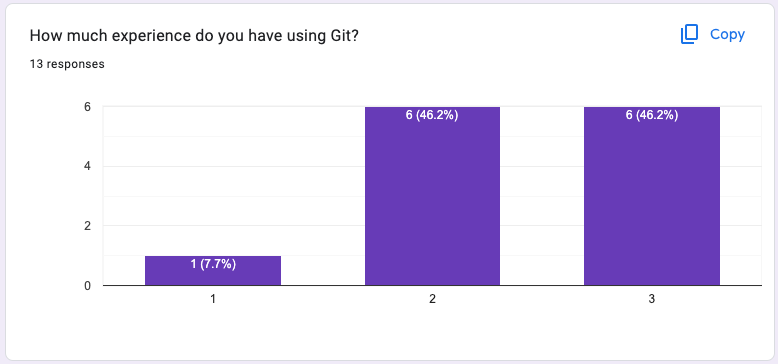
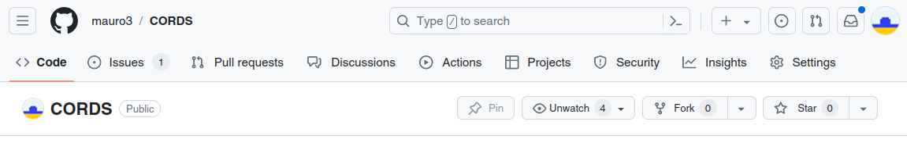

# A brief intro to Git

Git is a version control software, useful to
- keep track of your progress on code (and other files)
- to collaborate on code
- to distribute code, to onself (on other computers) and others
- it


---
## Previous experience

A few of you are familiar with git already (1=none, 2=some, 3=plenty):



Questions:
- did someone not manage to install git?
- do you use: `commit`, `push`, `pull`, `clone`?
- do you use: `branch`, `merge`, `rebase`?
- GitHub/GitLab etc? <!-- .element: class="fragment" data-fragment-index="1" -->


---

## A brief git demo session


For those with a new git install, setup Git:
```sh
git config --global user.name "Your Name"
git config --global user.email "youremail@yourdomain.com"

(note this info will be public with public commits, say on Github)
```


**Git demo, please follow along!**<!-- .element: class="fragment" data-fragment-index="1" -->

<div class="fragment" data-fragment-index="2">

- get help with `git help` or `git help init` for the `init` command
- make a repo in current directory with: `git init .`
- add some files to be tacked with: `git add`
- commit them into the history database with<br> `git commit -am "Some good message"`
- do some changes (`commit` some more)
- make a feature branch (`branch`, `diff`, `difftool`)
- merge branch (`merge`)
- tag (`tag`)
</div>

---

### Notes on the git demo

This demo was a purely local demo.  No interaction with a remote server was done (this is the next step).

All information git needs (history, tracked files, etc.) is stored in a local database which is hidden in the `.git` folder within top folder of the repository.  (But don't mess with this folder!)

The steps are recorded in [git.md](git.md#the-git-demo-steps)

---

### Further reading

There are (too) many resources on the web for Git...
- book: [https://git-scm.com/book/en/v2](https://git-scm.com/book/en/v2)
- videos: [https://git-scm.com/doc](https://git-scm.com/doc)
- cheat sheet (click on boxes) [https://www.ndpsoftware.com/git-cheatsheet.html#loc=workspace;](https://www.ndpsoftware.com/git-cheatsheet.html#loc=workspace;)
- get out of a git-mess: [http://justinhileman.info/article/git-pretty/git-pretty.png](http://justinhileman.info/article/git-pretty/git-pretty.png)

<br>
<br>

### Other tools for git
There is plenty of software to interact with git, graphical, command line, VSCode, etc.  Feel free to use those.

But we will only be able to help you with vanilla, command-line git. (ok and with the VS code integration)


---
## Getting started on GitHub
###  (similar on GitLab, or elsewhere)

GitHub, GitLab, etc. are social coding websites
- they host code
- they facilitate for developers to interact
- they provide infrastructure for software testing, deployment, etc
- and you can get followers, likes and the like 😬

💡 Note: WSL has a GitLab instance which you can use after sign up\
[https://gitlabext.wsl.ch/](https://gitlabext.wsl.ch/)
<!-- .element: class="fragment" data-fragment-index="1" -->

Question: who has used GitHub?
<!-- .element: class="fragment" data-fragment-index="2" -->

---
## Let's get our repo onto GitHub



- create a repository on github.com: click the "+", choose a name, etc.
- local: follow setup given on website (make sure to use the `https://` url)
- local: `git push`
  - this should just work, if you setup the password-less operation\
    --> if not lets fix it
---

### GitHub setup

Make such that you can push and pull without entering a password


<div class="fragment" data-fragment-index="1">

- local on Linux: `git config --global credential.helper cache`
- github.com:
  - "Your account" -> "Settings" -> "Developer settings" -> "Personal access tokens" -> "Generate new token"
    - Give the token a description/name and select the scope of the token
    - I selected "repo only" to facilitate pull, push, clone, and commit actions
  - -> "Generate token" and copy it into the password prompt
</div>

---

## Work with other people: pull request (PR)

When you contribute new code to a repo (in particular a repo which other people work on too), the new code is submitted via a "pull request".  This code is then in a separate branch.  A pull request then makes a nice web-interface where one can review the changes, request amendments and finally merge the code.

In a repo where you have write permission, the use following work-flow:
- make a branch and switch to it: `git switch -c some-branch-name`
- make changes, add files, etc. and commit to the branch.  You can have several commits on the branch.
- push the branch to Github
- on the Github web-page a bar with a "open pull request" should show: click it
- if you got more changes, just commit and push them to that branch
- when happy merge the PR

This work-flow we will use for helping you get some code into your toy-research project.

---

## Work with other peoples code: fork


For repos without write access, to contribute do:

- fork a repository on github.com (click on "fork" button): this creates a copy of a repository under your user
- make a branch on that fork and work on it
- push that to github and open a PR with respect to that fork
- (not needed in this workshop, so I will not go into more details)


---
**Git: questions?**

